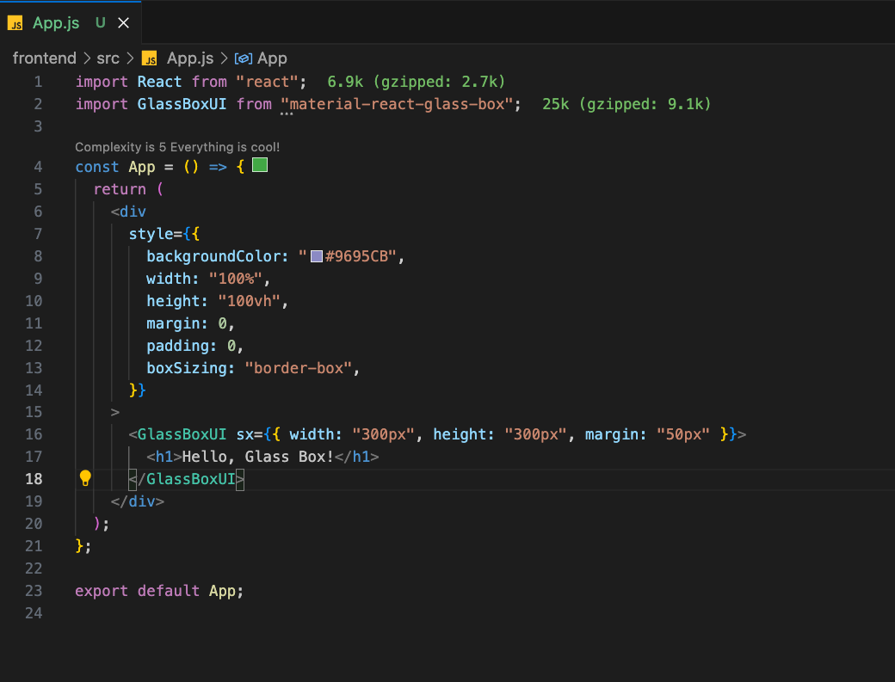

# glass-box-ui-npm-package

# MaterialGlassBoxUI

MaterialGlassBoxUI is a custom MUI (Material-UI) component that adds a glass effect to a box. It allows users to easily integrate a glassy appearance into their React applications.

## Installation

Install the package via npm:

npm install materialglassboxui

## Example

